## 1일차

### Home

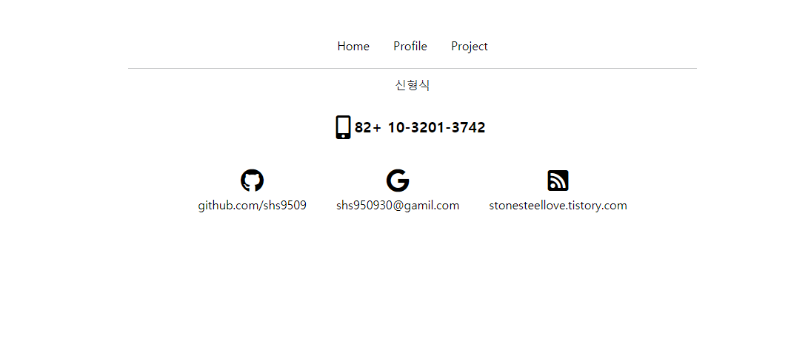

- bootstrap 의 컨포넌트 nav를 통해서 상단을 Home, Profile, Project 로 구성하였다.
- hr 태그를 통해서 구분선을 그었고 이부분에서 원하는 대로 되지 않아 고생했다.
  - 구분선이 자꾸 왼쪽으로 치우치게 되서 얻은 결과
  - margin:auto; 로 해결
  - 그뒤로도 대부분 한쪽으로 치우치는 것은 margin:auto 로 해결되었다.
- 폰트어썸을 통해서 깃헙, 구글, 블로그, 폰의 아이콘을 넣었다.
  - 아이콘의 크기 조절은 fa-?x 이런식으로 한다. 
  - 배치 문제로 원하는대로 되지않아 힘들었는데
  - flex 를 이용해서 붙였다가..뗐다가.. 붙였다가... 여러번 반복한 결과
  - 폰아이콘 밑에 링크 세개를 가로로 배치하는 원하는 배치를 얻었다.

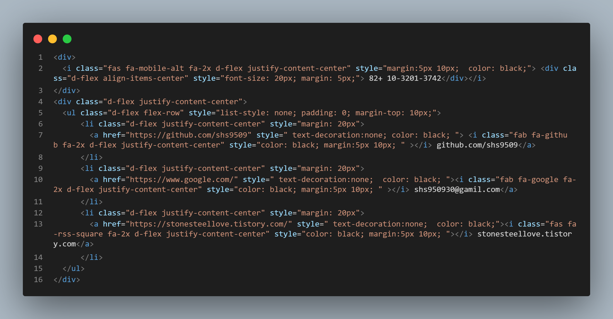

​													배운대로 했는데 맞는 방식인지는 모르겟다.


- **margin** 은 깔끔하게 배치하는 데 있어서 너무 중요한 역할을 한다.

------


### Profile


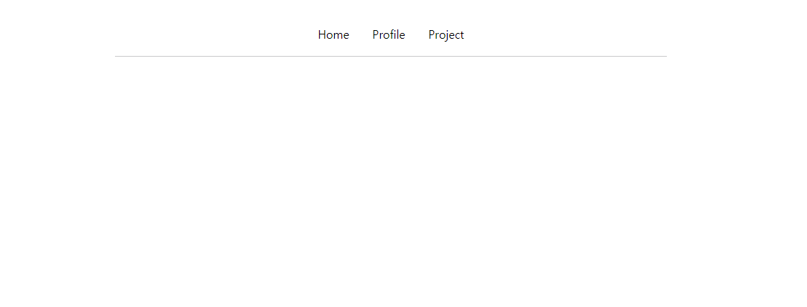

- profile 페이지는 구상을 디테일하게 안해서 일단 남겨놨다.


----


### Project

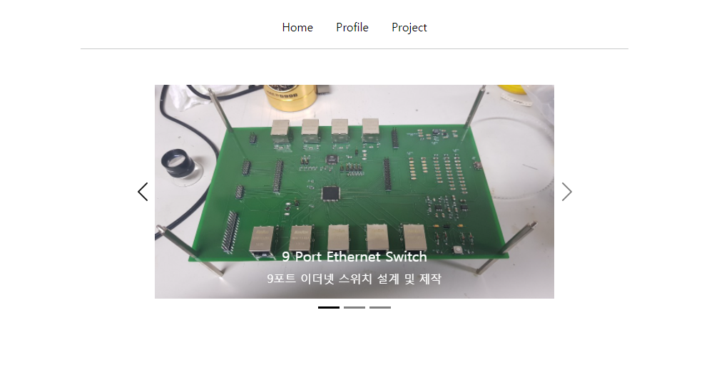

- 나를 한참을 고뇌하게 만들었던... 케러셀... 후.
  - 사진의 크기가 안맞아 캐러셀 크기가 계속 바뀌는것
  - 캐러셀의 크기를 정하면 한쪽으로 치워쳐져서 배치되는점
  - 간신히 사이즈조절 배치 다했더니 사진전환이 이상하게 되는점
  - 그외 등등
  - [nowonbun.tistory.com/707](https://nowonbun.tistory.com/707) 캐러셀 분석하는데 크게 도움이 되었다.
- 좀 배운것이 있다면 크기나 배치가 아무리 해도 안된다면 새로 div 로 감싸서 설정해주면 쉽게 된다는것


## 2일차

- 2일차에는 Home 과 Profile 을 만들었다.


### Home

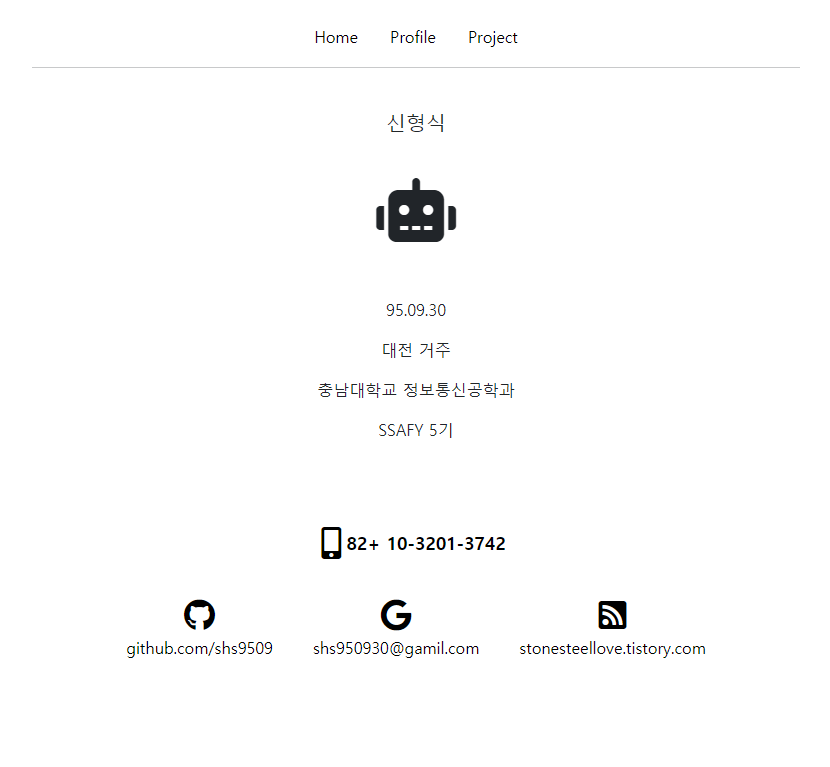

- 홈페이지에서 좀부족했던 설명을 추가하였고
  - flex 방향을 세로로 하여서 배치하였다.
- 사진을 추가하기보다 폰트어썸의 로봇머리를 추가였다.

-----


### Profile

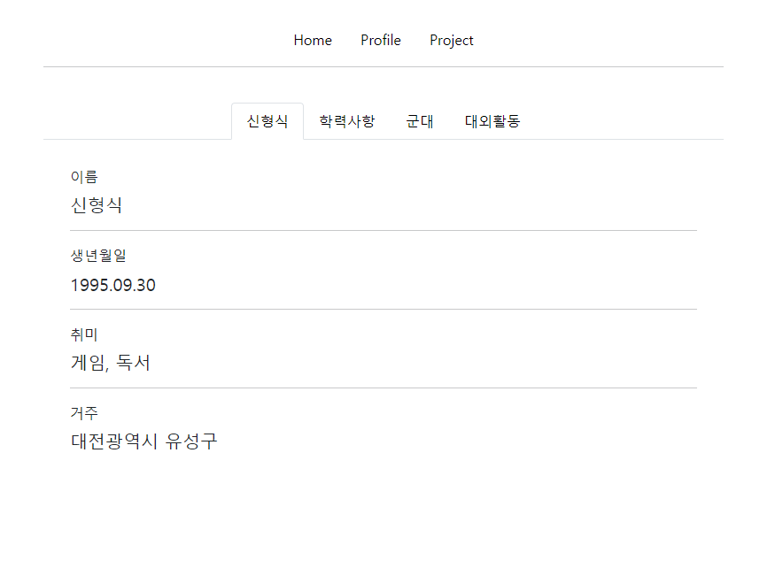

- 어떻게 구성할지 고민들 많이하면서 부트스트랩의 component를 계속 둘러봤다.
  - Popover 를 처음에 고려를 했고
  - List group 도 생각했다.
  - 결국 navigation 이달려있는 Card를 선택하였다.
- card의 nav가 색깔로 이상하고 엉성하게 자리를 잡았기 때문에 삭제하였다.
  - card의 nav 부분은 tab 을 사용하여 바꾸었다.
  - https://www.codingfactory.net/11453 감사할따름

- 크기는 width의 40%로 정해서 한눈에 그리고 깔끔하게 보이도록하였다.


## 3일차

- Project의 컨텐츠들을 추가했다.

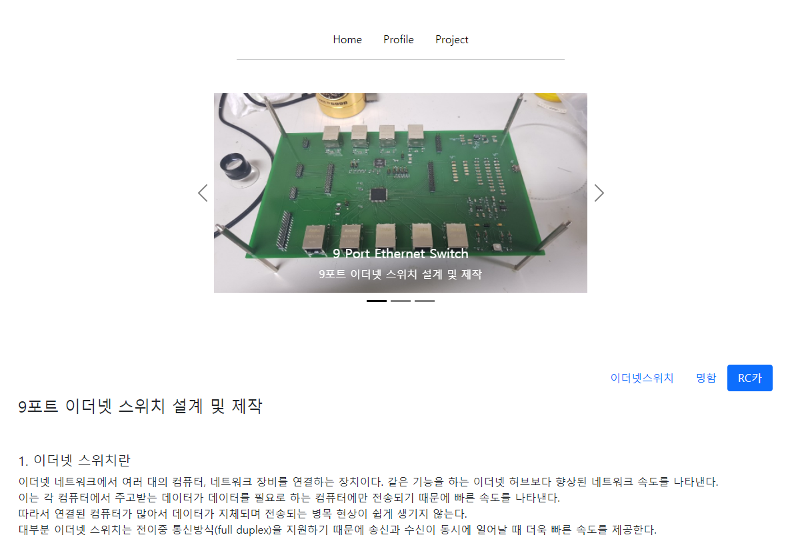


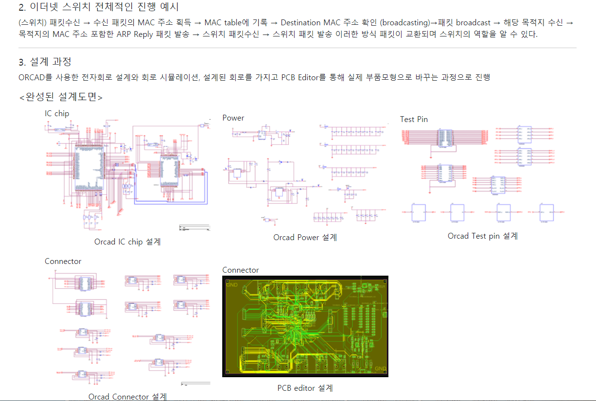


- 지금까지 했던 프로젝트를 추가를 하였다.
- 하면서 bootstrap 의 Scrollspy를 이용해서 버튼을 누르면 해당 프로젝트로 이동되도록 만들었다.
- 내용들을 채우면서 보기 힘들게 되는경우가 많아서 hr과 br 태그를 통해서 보기 쉽게 만들었다.
- 내용마다 li를 이용하여 마커가 보이게하여 보기 쉽게 할뿐더러 배치하기 쉽게 했다.
- 프로젝트의 경우 사진이 많아 이를  col 을이용하여 적절히 배치했다.


## 추가


### 사이트의 로고 만들기

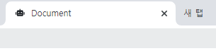

- https://www.favicon-generator.org/을 통해서 favicon을 만들어주고
- 링크를 넣어주고 이미지파일을 프로젝트파일에 넣어준다.

------


### 사이트의 썸네일 만들기


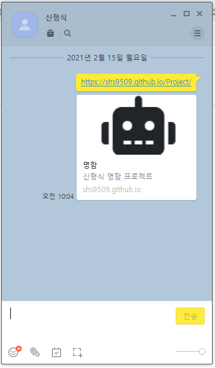

- https://developers.kakao.com/
- meta 데이터를 추가함으로서 사이트의 설명을 넣는다.

```html
  <meta property="og:type" content="website">
  <meta property="og:title" content="명함">
  <meta property="og:url" content="https://shs9509.github.io/Project/">
  <meta property="og:description" content="신형식 명함 프로젝트">
  <meta property="og:image:width" content="" />
  <meta property="og:image:height" content="" />
  <meta property="og:image" content="./images/썸네일.png">
```


-----


### 사이트 검색가능하게 하기


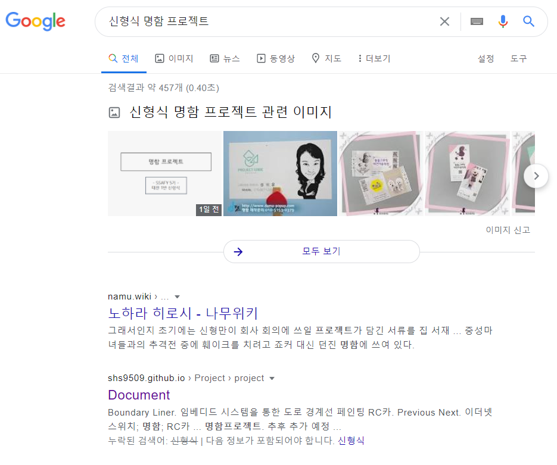

- https://www.xml-sitemaps.com/details-shs9509.github.io-8e2d2732b.html 
- 여기서 사이트맵을 생성한다음
- 구글 서치콘솔에 사이트를 등록을 하고 받은 링크를 html 파일에 넣는다.


## 완성

- home


--------


- Profile


----


- Project

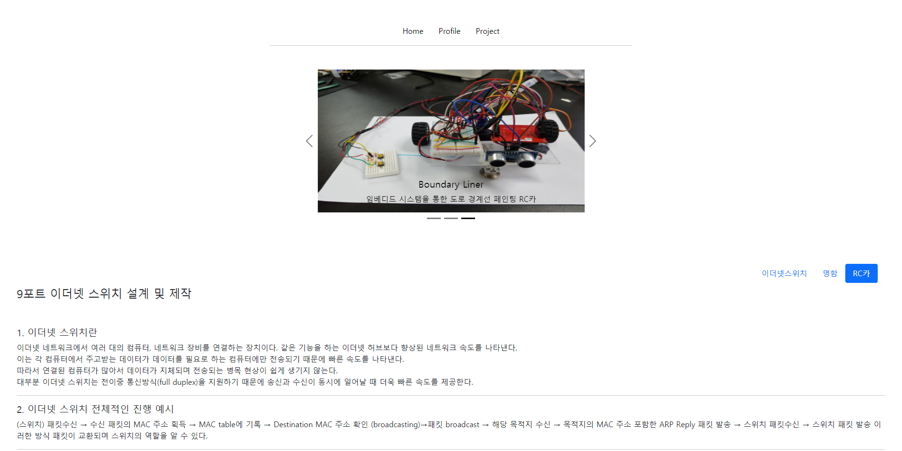